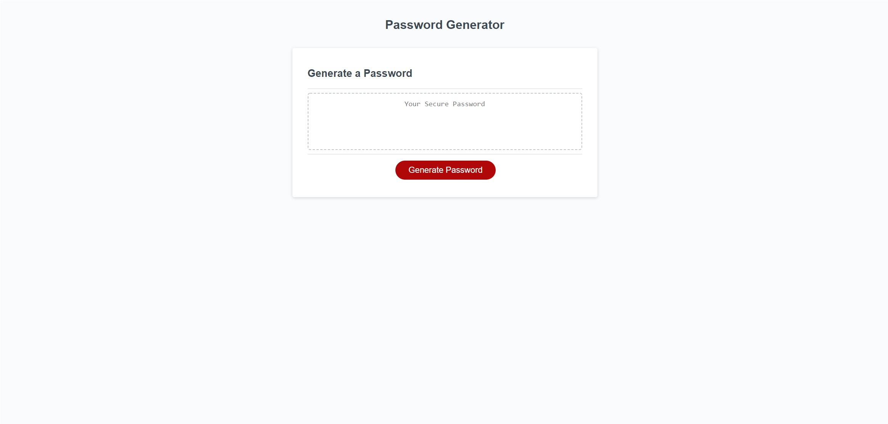

# Javascript-Password-Generator

## Description
Creating a auto generating password for web users using vanilla javascript, html, and css. Allowing the user to be able to choose what they want from a variety of options.
## Technologies used
 Using JS.

## Links
https://github.com/BerjGhazarian/Java-Password-Generator
https://berjghazarian.github.io/Java-Password-Generator/
## Image 
